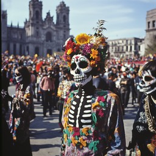

# Fiesta de Los Muertos

---

## O que é?

- **Fiesta de Los Muertos** é uma celebração tradicional mexicana.
- Ocorre nos dias 1 e 2 de novembro.
- Honra e lembra os entes queridos falecidos.
A Fiesta de los Muertos é uma forma de mostrarmos que amamos e sentimos falta dos nossos entes queridos. É uma maneira de celebrar a vida e a morte de forma alegre e respeitosa.

---

## Elementos Principais

- **Altares (Ofrendas)**:
  - Decorados com fotos, alimentos e objetos 
  que os falecidos gostavam.
   
  
- **Cempasúchil**:
  - Flor de calêndula, guia os espíritos de volta ao mundo dos vivos.
  

---

## Significado Cultural

- Mistura de tradições indígenas e influências católicas.
- Celebração da vida e da morte, não um luto.
a Fiesta de los Muertos é uma celebração única que reflete a rica história e cultura do México. Ao honrar os mortos, os mexicanos fortalecem seus laços familiares, celebram a vida e preservam suas tradições.
 

---

## Atividades Comuns

- **Desfiles**:
  - Festividades coloridas com danças e trajes tradicionais.
  
- **Visitas aos cemitérios**:
  - Famílias se reúnem para celebrar e lembrar.
  

---

## Imagem

---

 

---

## Conclusão

A Fiesta de Los Muertos é uma rica tradição cultural que une comunidades e famílias em celebração e lembrança. A conclusão da Fiesta de los Muertos é um momento de profunda reflexão e emoção. É um lembrete de que a vida é uma jornada e que a morte é apenas mais uma etapa dessa jornada.

---
# Um video explicativo
[Video sobre a celebração](https://youtu.be/J5UXnp4cmxU?si=Q8x72e5MAqsccGfj)

---
 

---
# Colégio Luis Viana - Turma A
# Curso: Administração - Espanhol
# Marcos Vinícius e Cauê Arthur